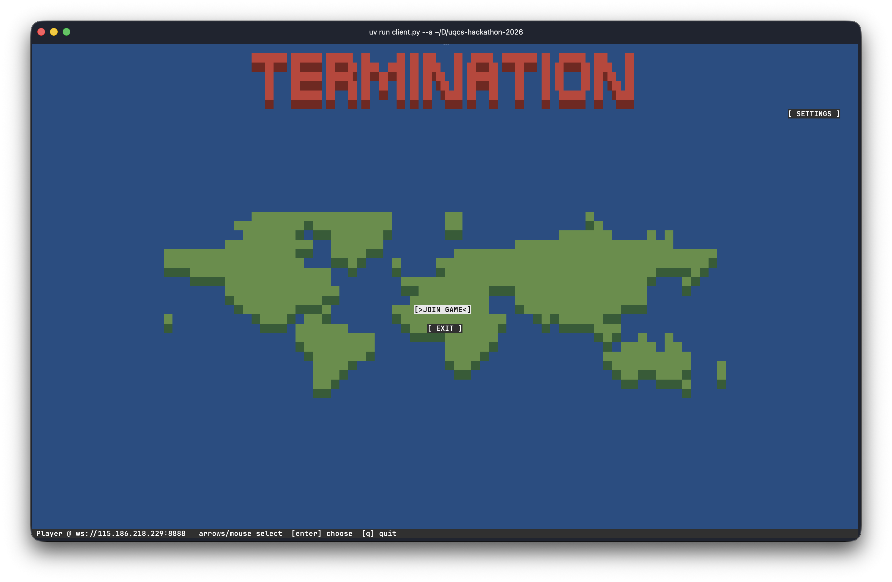

# UQCS Hackathon 2026 - Termination

A terminal game based off Risk and programming.

## Playing the Game

This game is very basic risk type grand strategy game. The rounds go:

### Solving Problem

In this stage you try and quickly solve a basic programming problem

### Allocating Troops

In this stage you allocate troops to your own territory or other adjacent territories

### Combat

The game automatically resolves combat and whoever has the most people left on a territory wins.

> [!NOTE]
> The code in this repository was primarily generated by Claude Opus 5 1M context, using the AI (Claude 5x plan).
>
> We can definitely explain some of the code.
